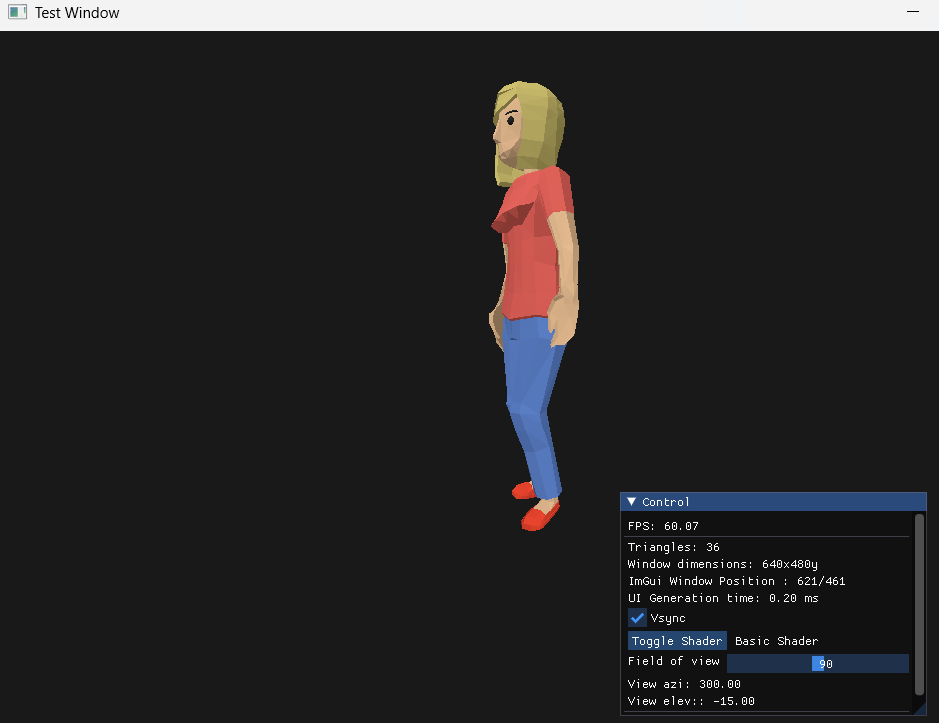

# Ankka

Animation library for learning purposes. Studying under the guidance of Dunsky & Szauer, following "Game Animation Engine programming" 2nd edition.

Will be kept public, but please do note that I do not own the initial code, and the repo will likely contain elements outside of my IP, which are published under MIT license.

Please also note : I am in no way affiliated with the authors, and have simply opted for a public repo out of habit/convenience.

The original repository can be found on:
https://github.com/PacktPublishing/Cpp-Game-Animation-Programming-Second-Edition

Currently not accepting contributions.

### Status

As of 28.04., some painful decision have been made to simplify and clean away some non-working abstractions.
Now following the book more closely in order to finish in timely manner ie over the summer for a university programming exercise project.

More sophisticated glTF loading on the roadmap after finishing the book or as a separate effort from the main branch.

