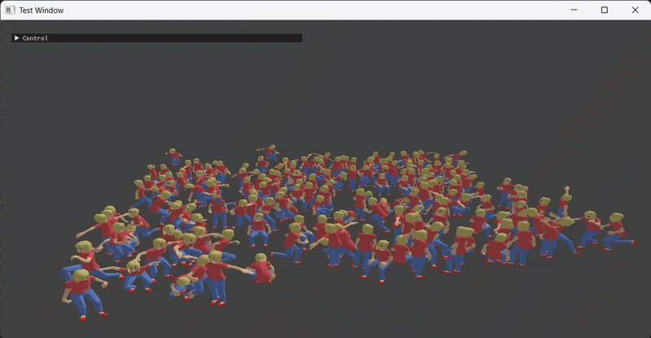

# Ankka

Animation library for learning purposes. Studying under the guidance of Dunsky & Szauer, following "Game Animation Engine programming" 2nd edition.

Will be kept public, but please do note that I do not own the initial code, and the repo will likely contain elements outside of my IP, which are published under MIT license.

Please also note : I am in no way affiliated with the authors, and have simply opted for a public repo out of habit/convenience.

The original repository can be found on:
https://github.com/PacktPublishing/Cpp-Game-Animation-Programming-Second-Edition

Currently not accepting contributions.

### Status

Looking for a suitably scoped example app next after finishing book

 #### Milestone update : 27.06.2026

Milestone update on 27.6. Finished book, did some optimizations and GPU instancing of model

